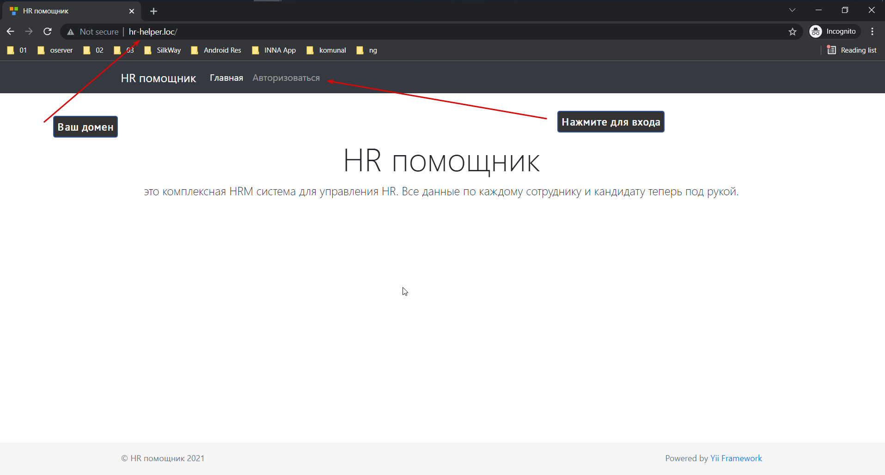

## HR helper
##### Инструмент для менеджмента персонала, рекрутинга и HR
 
Используемые технологии
------------

- Php 7.3
- Yii 2 framework
- MySql / MariaDB 10.3
- Composer 2.0.14

Сборка проекта
------------

1. Клонируйте этот репозиторий на свой компьютер
```yaml
git clone https://github.com/NurbekMakhmudov/hr-helper.git
```

##### Для сборки нужен *Composer version 2.0.14* и выше

2. Запустите эту команду из терминала
```yaml
cd hr-helper
```

```yaml
composer update
```

```yaml
init
```

3. Отредактируйте файл `common/config/main-local.php` для своей базы данных

```php
return [
    'components' => [
        'db' => [
            'class' => 'yii\db\Connection',
            'dsn' => 'mysql:host=localhost;dbname=name_your_db',
            'username' => 'root',
            'password' => 'root',
            'charset' => 'utf8',
        ],
        ...
    ],
];
```

4. Запустите эту команду из терминала
```yaml
yii migrate
```

#### Скриншоты приложения:

##### Главная страница:

------------

##### Страница авторизоваться:

------------
  
##### Страница администратора:

------------
   
##### Страница отделы:

------------

##### Форма для создания новой отдел:

------------

##### Форма, где можно посмотреть сотрудников по отделам:

------------

##### Форма, где можно посмотреть в каких отделах состоит конкретный сотрудник:

------------


## License

Это программное обеспечение с открытым исходным кодом под лицензией [MIT license](https://opensource.org/licenses/MIT).
